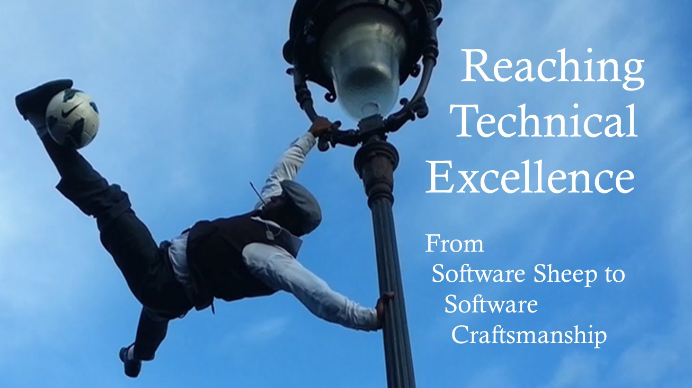

# Reaching Technical Excellence - From Software Sheep to Software Craftsmanship

## Talk Description

3 continents, 50+ agile teams, 500+ developers, and a collective agile hangover. A true story of a quest toward technical excellence.

In the talk, I share experiences and lessons learned from a challenging change management quest undertook to transform the company's mindset and skill set.

What is the agile hangover, and how to overcome it? 
What are software sheep, and how not to be one? 
How to push an organization toward genuine software craftsmanship?

You will learn what we as a world's leading automotive technology company did to become better software craftsmen. The chances are high that the approach we took might work for your company as well.

## Talk History

|                           Version                            | Date                          | Event                                                        |       City        | Country | Video |
| :----------------------------------------------------------: | ----------------------------- | ------------------------------------------------------------ | :---------------: | ------- | ----- |
| [v2.4.0](https://github.com/ironcev-talks/reaching-technical-excellence-from-software-sheep-to-software-craftsmanship/releases/tag/2021-11-16-Graz-Austria-Agile-International-Graz-Meetup) | November&nbsp;16th,&nbsp;2021 | [[Meetup] Agile International Graz](https://www.meetup.com/agile-international-graz/events/281563714/) | Graz | Austria | - |
| [v2.0.0](https://github.com/ironcev-talks/reaching-technical-excellence-from-software-sheep-to-software-craftsmanship/releases/tag/2018-12-05-Zagreb-Croatia-Advanced-Technology-Days-Conference) | December&nbsp;5th,&nbsp;2018 | [[Conference] Advanced Technology Days](https://advtechdays.com/) | Zagreb | Croatia | - |
| [v1.0.0](https://github.com/ironcev-talks/reaching-technical-excellence-from-software-sheep-to-software-craftsmanship/releases/tag/2018-05-18-Graz-Austria-Agile-Austria-Conference) | May&nbsp;18th,&nbsp;2018 | [[Conference] Agile Austria](https://agile-austria.org/en/) (with [Stefan Wunder](https://twitter.com/stwunder)) | Graz | Austria | [YouTube](https://www.youtube.com/watch?v=nOESnHoDHjQ) |

## Presentations

The latest minor version of the presentation is available for viewing and download on [SlideShare](https://www.slideshare.net/roncevi/reaching-technical-excellence-from-software-sheep-to-software-craftsmanship) and [Speaker Deck](https://speakerdeck.com/ironcev/reaching-technical-excellence-from-software-sheep-to-software-craftsmanship). The exact presentations used in talks are available on the [release page](https://github.com/ironcev-talks/reaching-technical-excellence-from-software-sheep-to-software-craftsmanship/releases). The presentations used in talks vary significantly from each other. Their content depends on the exact talk format, duration, and audience. The version on SlideShare and Speaker Deck contains all the slides.

## License

The presentations are licensed under [CC BY 4.0](https://creativecommons.org/licenses/by/4.0/).
